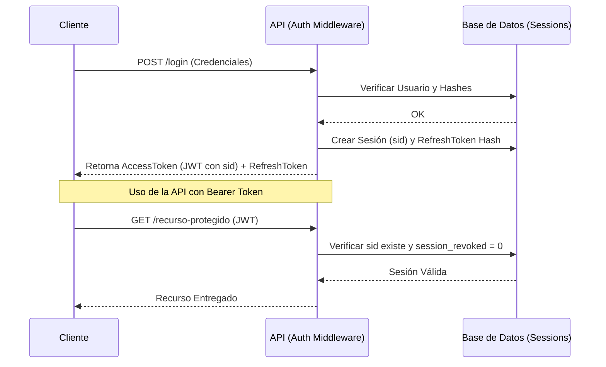

# Midd Autorizador API 🛡️


**Sistema de Autenticación y Autorización basado en TypeScript, Express y JSON:API.**

Este proyecto es una API REST robusta y modular diseñada para gestionar la identidad de usuarios, sesiones seguras y control de acceso mediante tokens JWT. Implementa las mejores prácticas de desarrollo con **TypeScript** y sigue el estándar **JSON:API** para la estructura de respuestas.

---

## 🚀 ¿Qué problema soluciona?

Proporciona una capa de seguridad centralizada que puede ser reutilizada por múltiples servicios o clientes (Web/Mobile). Resuelve la complejidad de:

- **Autenticación Segura**: Login, registro y hashing con Argon2.
- **Gestión de Sesiones**: Manejo de _Access Tokens_ y _Refresh Tokens_ persistidos en DB.
- **Revocación Proactiva**: Capacidad para invalidar sesiones instantáneamente sin esperar a que el JWT expire.

### 📊 Flujo de Autenticación

El siguiente diagrama muestra cómo interactúan el cliente, la API y la base de datos durante una sesión:



---

## 🖥️ Panel de Control (Dashboard)

El proyecto incluye una **Landing Page interactiva** disponible en la ruta raíz (`/`). Este dashboard permite:

- **Verificar el Estado**: Confirmar visualmente si el servicio está en línea.
- **Métricas Rápidas**: Ver entorno (`ENV`), versión de Node y puerto activo.
- **Utilidad de Copia**: Botón interactivo para copiar la URL base de la API al portapapeles.
- **Cero Redirecciones**: Diseñado para ser informativo y seguro, sin enlaces externos.

---

## 🔥 Características de Seguridad (Core Auth)

La implementación incluye controles estrictos y funcionalidades avanzadas:

- **Rotación de Refresh Token**: Seguridad mejorada mediante la emisión de nuevos refresh tokens en cada uso.
- **Hash del Refresh Token**: Los tokens de refresco se almacenan hasheados en la base de datos (seguridad ante leaks).
- **Sessions en DB**: Control total del estado de las sesiones persistidas en base de datos (`Session` model).
- **Control de Revocación (`revoked_at`)**: Capacidad de invalidar sesiones específicas o masivas instantáneamente.
- **Auditoría de Acceso (`last_login`)**: Registro automático de la última actividad del usuario.
- **Argon2**: Hashing de contraseñas más seguro que bcrypt.
- **JWT con SID**: Los tokens incluyen el `session_id` (sid) para vincularlos a una sesión válida.
- **Middleware de Sesión Real**: Validación dual (Firma JWT + Estado en BD) para impedir acceso con tokens válidos de sesiones revocadas.

---

## 🏗️ Arquitectura del Proyecto

El proyecto sigue una **Arquitectura en Capas** (Layered Architecture) para garantizar la separación de responsabilidades y la escalabilidad.

### Estructura de Directorios

```
src/
├── config/         # Configuración del servidor, base de datos, Swagger y entorno.
├── controllers/    # Controladores que manejan las peticiones HTTP (Entrada/Salida).
├── database/       # Configuración del ORM (Sequelize), Modelos y Migraciones.
│   └── models/     # Definición de tablas (User, Session).
├── entities/       # Objetos de dominio o DTOs.
├── errors/         # Manejo centralizado de errores y excepciones personalizadas.
├── middlewares/    # Interceptores para autenticación, validación y seguridad.
├── repositories/   # Capa de acceso a datos (interacción directa con la BD).
├── routes/         # Definición de rutas y endpoints de la API.
├── services/       # Lógica de negocio (actualmente integrada en controladores/repos).
├── types/          # Definiciones de tipos TypeScript globales.
├── utils/          # Utilidades transversales (Logger, JWT, JSON:API Response).
└── validators/     # Esquemas de validación de datos de entrada (Express Validator).
```

### Componentes Principales

- **Server (`src/config/server.ts`)**: Clase principal que orquesta la inicialización de Express, seguridad (Helmet, CORS) y Swagger.
- **Auth Controller (`src/controllers/auth.controller.ts`)**: Gestiona la lógica de autenticación: Login, Registro, Refresh Token y Logout.
- **Middleware de Autenticación (`src/middlewares/authentication.middleware.ts`)**:
  - `checkBearer`: Valida que el token JWT sea válido y que la sesión no haya sido revocada.
  - `methodValidator`: Asegura que el método HTTP sea el correcto.
  - `contentTypeValidator`: Enforza el uso de `application/vnd.api+json`.
- **Modelos (`src/database/models`)**:
  - `User`: Representa al usuario del sistema.
  - `Session`: Almacena las sesiones activas y tokens de refresco.

---

## 🛠️ Tecnologías Utilizadas

- **Lenguaje**: [TypeScript](https://www.typescriptlang.org/)
- **Framework Web**: [Express](https://expressjs.com/)
- **Base de Datos**: MySQL con [Sequelize ORM](https://sequelize.org/)
- **Seguridad**:
  - [Argon2](https://github.com/ranisalt/node-argon2): Hashing de contraseñas de última generación.
  - [JsonWebToken (JWT)](https://jwt.io/): Manejo de sesiones stateless.
  - [Helmet](https://helmetjs.github.io/): Protección de headers HTTP.
- **Validación**: `express-validator` y `joi`.
- **Documentación**: [Swagger](https://swagger.io/) (OpenAPI).
- **Logging**: `log4js`.
- **Testing**: `jest` con `supertest`.

---

## ⚙️ Instalación y Configuración

### Prerrequisitos

- Node.js (v18 o superior)
- MySQL
- npm

### Pasos

1. **Instalar dependencias**:

   ```bash
   npm install
   ```

2. **Configurar Variables de Entorno**:
   Copia el archivo de ejemplo y configura tus credenciales.

   ```bash
   cp .env.example .env
   ```

   **Variables clave en `.env`**:
   - `PORT`: Puerto del servidor.
   - `DB_*`: Credenciales de conexión a MySQL.
   - `TOKEN`: Token interno para validación de aplicaciones (AppKey).
   - `SECRET_KEY`: Llave maestra para firmar los JWT.

3. **Base de Datos**:
   Asegúrate de que la base de datos configurada en `.env` exista en MySQL.

   ```bash
   # Ejecutar migraciones
   npm run migrate

   # (Opcional) Ejecutar seeders para datos iniciales
   npm run seeder
   ```

---

### 🐳 Docker (Recomendado)

Inicia todo el entorno (API + MySQL) con un solo comando:

```bash
docker-compose up -d --build
```

---

## 📖 Guía de Uso

### Endpoints Principales (Prefix: `/api/v1`)

| Método | Endpoint         | Descripción                                      | Requiere Auth      |
| ------ | ---------------- | ------------------------------------------------ | ------------------ |
| `POST` | `/login`         | Inicia sesión y retorna tokens.                  | No                 |
| `POST` | `/register`      | Crea un nuevo usuario.                           | No                 |
| `POST` | `/refresh_token` | Renueva el Access Token usando el Refresh Token. | No (Header AppKey) |
| `POST` | `/logout`        | Cierra la sesión activa del dispositivo.         | **Sí (Bearer)**    |
| `POST` | `/logout_all`    | Revoca todas las sesiones del usuario.           | **Sí (Bearer)**    |

> [!NOTE]
> La documentación extendida (Swagger) está disponible en `/docs` cuando el entorno `ENV` no es `production`.

---

## 📄 Documentación Interna y Ejemplos

### Validaciones de Seguridad

El middleware de autenticación (`checkBearer`) realiza una doble verificación:

1. **Verificación de Firma**: Comprueba que el JWT haya sido firmado con la `SECRET_KEY`.
2. **Verificación de Estado**: Consulta la base de datos (`Session` model) para asegurar que el token no pertenece a una sesión revocada o cerrada.

### Formato de Respuesta

El proyecto implementa estrictamente respuestas JSON:API con content-type `application/vnd.api+json`.

**Ejemplo de Petchición (Login):**

```json
POST /api/v1/login
Content-Type: application/vnd.api+json

{
  "data": {
    "type": "user",
    "attributes": {
      "email": "usuario@ejemplo.com",
      "password": "PasswordSecreta123",
      "device_id": "mi-iphone-13",
      "device_type": "ios"
    }
  }
}
```

---

## 📦 Comandos del Proyecto

| Comando                 | Descripción                                              |
| ----------------------- | -------------------------------------------------------- |
| `npm run dev`           | Inicia el entorno de desarrollo con `ts-node-dev`.       |
| `npm run build`         | Compila el código TypeScript a JavaScript en `build/`.   |
| `npm start`             | Ejecuta el código compilado (producción).                |
| `npm run migrate`       | Ejecuta las migraciones de Sequelize pendientes.         |
| `npm run migrate:undo`  | Deshace la última migración.                             |
| `npm run new:migration` | Crea un nuevo archivo de migración (esqueleto).          |
| `npm run test`          | Ejecuta las pruebas unitarias con Jest.                  |
| `npm run lint`          | Revisa el código en busca de errores de estilo (ESLint). |
| `npm run prettier`      | Formatea el código automáticamente.                      |

---

## ✅ Buenas Prácticas Implementadas

1. **Separación de Responsabilidades**: Uso claro de Controladores, Repositorios y Modelos.
2. **Seguridad por Defecto**:
   - `Helmet` para headers HTTP seguros.
   - Validación estricta de Content-Type.
   - Hashing fuerte con `Argon2`.
3. **Manejo de Errores**: Clase centralizada `ErrorException` y respuestas de error estandarizadas JSON:API.
4. **Validación de Datos**: Uso de `express-validator` antes de que los datos lleguen al controlador.
5. **Configuración Tipada**: Uso de interfaces TypeScript para configuraciones y respuestas.

---

## 🔮 Roadmap / Mejoras Futuras

Basado en el análisis del código actual, estas son las áreas de mejora sugeridas:

- **Cobertura de Tests**: Expandir los tests unitarios y de integración (actualmente la estructura existe en `tests/` pero se puede ampliar).
- **Módulos Adicionales**: Implementar gestión de Roles y Permisos (RBAC) más allá de la autenticación básica.
- **Dockerización Completa**: Aunque existe un `Dockerfile`, se podría mejorar el `docker-compose` para incluir servicios como Redis (para caché de sesiones si se escala).
- **CI/CD**: Integrar pipelines de GitHub Actions o GitLab CI para testeo automático.

---

## 📜 Licencia

Este proyecto se distribuye bajo la licencia **MIT**.
